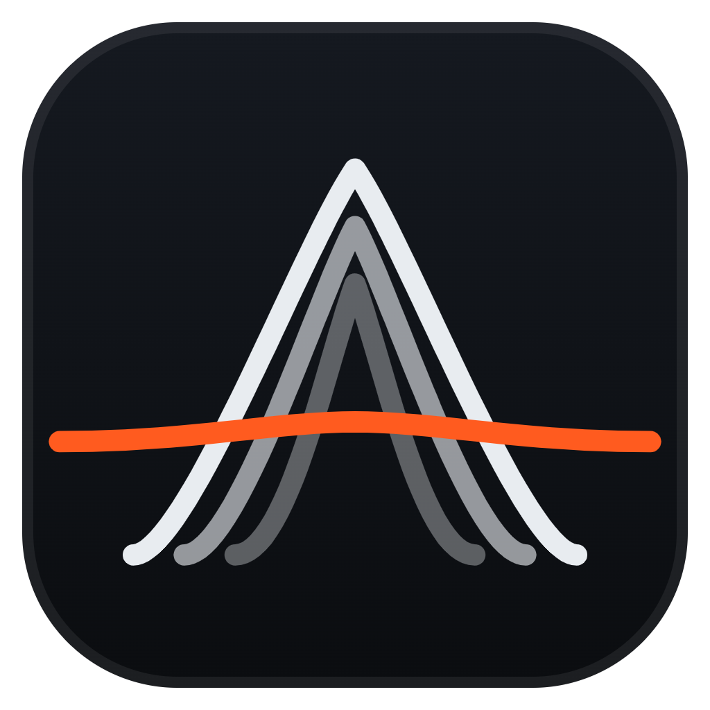

<div align="center">



# AERO

**Next-Gen Local File Transfer**
Phone ↔ PC • Encrypted • Blazing Fast

[](LICENSE)
[](https://go.dev)
[](https://github.com/HarshalPatel1972/aero/releases)

</div>

---

## 🚀 Features

*   **⚡ Fast**: Parallel, chunked transfers with encryption spread across your phone's CPU cores. Speed is usually limited by your Wi-Fi: expect roughly 3–8 MB/s on 2.4 GHz, 15–40 MB/s on 5 GHz Wi-Fi 5, and more on Wi-Fi 6.
*   **🔒 End-to-End Encrypted**: Every file, file name and message is encrypted and authenticated with XChaCha20-Poly1305 using a one-time key shared only through the QR code.
*   **📱 Universal Client**: Works on **any** device (iOS, Android, Mac, Linux) via browser. No app install required on the phone.
*   **🌬️ Built on aerodynamics**: The name comes from aerodynamics, and so does the interface: a live wind-tunnel view where real potential-flow streamlines part around your QR code and speed up with every transfer.
*   **🖱️ Drag & drop**: Drop files anywhere on the window to send them to your phone. Mini-Mode keeps a slim bar on top while you work.
*   **📦 Portable or Installed**: Available as a standard Windows Installer (`.exe`) or portable binary.

---

## 📥 Installation

### Windows

**[⬇ Download Aero for Windows (installer)](https://github.com/HarshalPatel1972/aero/releases/latest/download/Aero_Setup.exe)**, or grab the **[portable Aero.exe](https://github.com/HarshalPatel1972/aero/releases/latest/download/Aero.exe)** (no install needed).

1.  Run `Aero_Setup.exe` and launch **Aero** from your desktop or Start menu.
2.  Windows may show a SmartScreen notice until the app is code-signed: click **More info → Run anyway**.
3.  Verify your download against [`checksum.sha256`](https://github.com/HarshalPatel1972/aero/releases/latest/download/checksum.sha256) if you like. All versions are on the [Releases page](https://github.com/HarshalPatel1972/aero/releases).

### Quick Start
1.  **Launch Aero** on your PC.
2.  **Scan the QR Code** with your phone's camera.
3.  **Drop files** on either device — they transfer instantly.

---

## 🛡️ Security Model

AERO assumes other devices on your network may be watching.

1.  **Session Key**: A fresh 256-bit key is generated every time you start the server, and wiped when you stop it.
2.  **Optical Exchange**: The key travels only inside the QR code, in the URL fragment (`#k=…`), which browsers never send over the network.
3.  **Encryption**: Every file chunk, file name and control message is sealed with XChaCha20-Poly1305 (via the audited [@noble/ciphers](https://github.com/paulmillr/noble-ciphers) library in the browser). Each chunk is bound to its transfer and position, so tampering, reordering or splicing is detected.
4.  **Authentication**: Every request carries a single-use token derived from the key. Devices without the QR code cannot connect, upload, or download anything, and captured requests cannot be replayed.
5.  **Least Access**: The phone can only download files you explicitly pick on the PC. Received files are saved to `Downloads\Aero` and never overwrite existing files.

**Limits, stated honestly:** the phone page is served over plain `http://` on your LAN, so an attacker who can actively intercept and modify your Wi-Fi traffic (not just observe it) could serve a tampered page. Use Aero on networks you trust, such as your home Wi-Fi, rather than public hotspots.

> **Privacy Promise**: No cloud. No accounts. No history on our side. Files go directly between your devices.

---

## 🏗️ Build From Source

### Prerequisites
*   [Go 1.26+](https://go.dev/dl/)
*   [Node.js 18+](https://nodejs.org/)
*   [Wails CLI](https://wails.io/) (`go install github.com/wailsapp/wails/v2/cmd/wails@latest`)
*   *(Optional)* [NSIS](https://nsis.sourceforge.io/) (for building the installer)

### Build Commands

```powershell
# Clone repository
git clone https://github.com/HarshalPatel1972/aero.git
cd aero

# Development (Hot Reload)
wails dev

# Production Build (Auto-Magic)
# Builds Binary + Installer + Checksums
.\scripts\build_release.ps1
```

The version number lives in one place: `info.productVersion` in `wails.json`.

### Releasing
Official releases are built by GitHub Actions, not locally. Bump `info.productVersion` in `wails.json`, merge to `main`, then push an annotated tag whose message is the release notes:

```sh
git tag -a v2.1.0 -m "What changed…"
git push origin v2.1.0
```

The [Release workflow](.github/workflows/release.yml) runs the tests, builds `Aero.exe` and `Aero_Setup.exe` on a clean Windows runner and publishes the GitHub release.

### Code Signing
Unsigned apps trigger Windows SmartScreen warnings. Buy a code-signing certificate, then set either `AERO_SIGN_PFX` + `AERO_SIGN_PASSWORD` or `AERO_SIGN_THUMBPRINT` before running the build script. See the header of `scripts/build_release.ps1`.

### Manual Artifact Generation
*   **Frontend** (required once in a fresh clone): `cd frontend; npm ci; npm run build`
*   **Binary Only**: `wails build -platform windows/amd64 -clean -ldflags "-s -w"`
*   **Binary + Installer**: `wails build -platform windows/amd64 -clean -ldflags "-s -w" -nsis`
*   **Icons**: `.\scripts\png2ico.ps1 -SourcePng "build\appicon.png" -DestIco "build\windows\icon.ico"`

---

## 🔧 Architecture

| Component | Tech Stack |
|-----------|------------|
| **Core** | Go (Golang) 1.24 |
| **GUI** | Wails v2 + React + TypeScript |
| **Styling** | TailwindCSS + Framer Motion |
| **Crypto** | XChaCha20-Poly1305: `@noble/ciphers` (phone) + `golang.org/x/crypto` (PC) |
| **Protocol** | Encrypted, authenticated chunked HTTP + WebSocket (see `internal/security/security.go`) |

---

## ✍️ Code Signing Policy

Free code signing provided by [SignPath.io](https://about.signpath.io), certificate by [SignPath Foundation](https://signpath.org).

Every release binary is built from this repository's source by the public [Release workflow](.github/workflows/release.yml) on GitHub Actions, never on a personal machine. Signing requests are created by that workflow and must be manually approved before anything is signed.

**Team roles**

| Role | Member |
|------|--------|
| Committers and reviewers | [@HarshalPatel1972](https://github.com/HarshalPatel1972) (repository owner) |
| Approvers | [@HarshalPatel1972](https://github.com/HarshalPatel1972) |

All team members use multi-factor authentication for GitHub and SignPath.

**Privacy policy:** This program will not transfer any information to other networked systems unless specifically requested by the user or the person installing or operating it. Aero only exchanges data with the phone you link by scanning its QR code, directly over your local network. It has no telemetry, analytics, accounts or cloud servers, and it does not check for updates in the background.

---

## 📄 License

MIT License — See [LICENSE](LICENSE) for details.

<div align="center">
<b>Built for Speed. Designed for Privacy.</b>
</div>
